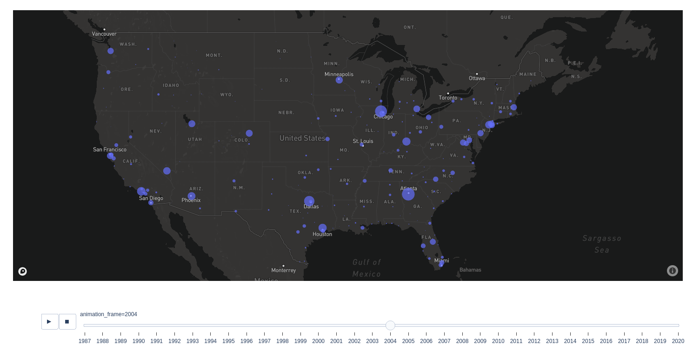

This project uses the [Airline Reporting Carrier On-Time Performance Dataset](https://developer.ibm.com/exchanges/data/all/airline/?mhsrc=ibmsearch_a&mhq=%20Airline)
from IBM Developer. This dataset includes two CSVs containing all US Domestic Flight Data from the BTS between 1987 and 2020. The dataset contains basic information about each flight (such as date, time, departure airport, arrival airport) and, if applicable, the amount of time the flight was delayed and information about the reason for the delay.

This dataset included two splits, a randomly sampled split containing 2e06 samples, and a full split containing 2e08 rows. For the purposes of this project, the former dataset will be used

The data-story for this project is located mainly in the [EDA Notebook](src/eda.ipynb)

# Project Goals
Predict the likelihood of your flight arriving on time given week-day, scheduled departure time, route and time-of-year (quarterly or weekly). This will be formulated as a classification problem, and will be solved using the Decision-Tree Algorithm

# Learning Outomes
- [x] Become familiar with Bokeh and Datashader for plotting large datasets
- [x] Use NVIDIA Rapids to accelerate parralelizable operations on the GPU for columnar operations
- [x] Use XGBoost on GPU to perform the aforementioned classification

# Technologies Used
- [NVIDIA RAPIDS](https://developer.nvidia.com/rapids) 
- [Bokeh](https://docs.bokeh.org/en/latest/index.html)
- [Datashader](https://datashader.org/)
- [XGBoost](https://github.com/dmlc/xgboost)

# Future Plans
- Re-do project using Dask and RAPIDS to perform classification on out-of-memory dataframes
- Deployment on a Flask Server to perform real-time prediction of the chances of your flight being delayed

# Tasks
- [x] Explore feature-selection methods (stepwise, lasso, etc)
- [x] Address multicollinearity
- [x] Read/implement Random forest using XGBoost

